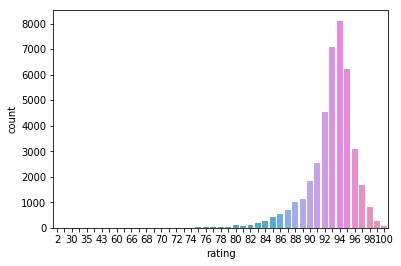
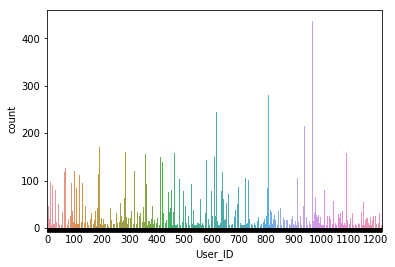
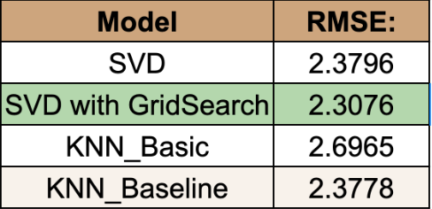

# Whiskey Recommendation System

## Project Overview

For this project, we set out to help adults in expanding their whiskey palette through a recommendation system. We webscrapped Whiskeybase.com for their top 1000 rated whiskies as well as their list of newly released whiskies to get user ratings, user names, and the whiskey to build our recommender. Please see below for how our recommender system works

  

As you see above, we ask the end-user to input how many recommendations they would like as well as their budget. We then ask them to rate 5 whiskies that fall within their budget. If the user has not tasted the whiskey before, we provide a URL for them to go to the whiskeybase site for additional information to make an educated case. We also give the user an option for a new whiskey to rate by pressing 'n'. 

Once the user has reviewed 5 whiskies, we refit our model to include their preferences and output the number of recommendations they requested based on how closely their ratings matched other users in our database.

## Initial EDA

Once we consolidated our datasets and got rid of NaN values and duplicates, we took a look at how the users were rating the whiskies.

  <u><b> Preview of Dataframe </b></u>

 

Our final dataframe has 1,223 unique users, 1,092 unique whiskies, and 41,018 total reviews.

  <u><b> Distribution of Ratings </b></u>

 

  

 

As we can see from the image above, most of the users on this site rated the whiskies fairly highly as a majority of our reviews range from mid 70's to 100. This makes sense as a lot of these whiskies are part of the top 1000 rated whiskies, so they should be highly rated.

  <u><b> Distribution of User Reviews </b></u>

 

  

 

Based on the image above, the users on this site are fairly active with a majority of them having reviewed many different types of whiskies. To ensure our model would have enough data points to leverage, we filtered out users to only include ones who have over 5 reviews in total. 

## Initial Models

When deciding which model to ultimately used, we compared performances between different models within Surprise. This includes SVD, KNN_Basic, and KNN_Baseline. The results of all 3 models were incredibly close with a RMSE around 2.3780. 

  <u><b> RMSE Scores of the models </b></u>

 

  

 

After tuning hyperparameters over several interations of GridSearch, our final model was SVD with the final error metric RMSE = 2.3076.

## Conclusion

Our recommendation system caters to our user by only recommending whiskies within their budget after they evaluate 5 whiskies that also fall within their budget. Throughout the entire process, our system is transparent to the end user and provides URL links to provide additional information in case the user decides to purchase a bottle based on our recommendations.

